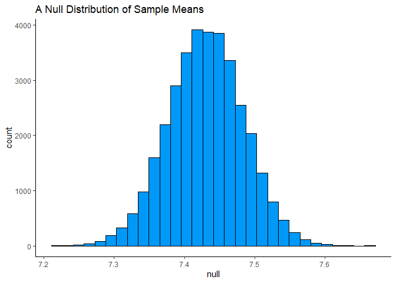

Lab 11 - Smoking during pregnancy
================
Colin Li
4/4/2023

### Load packages and data

``` r
library(tidyverse) 
```

    ## Warning: package 'tidyverse' was built under R version 4.2.3

    ## Warning: package 'ggplot2' was built under R version 4.2.3

    ## Warning: package 'tibble' was built under R version 4.2.3

    ## Warning: package 'tidyr' was built under R version 4.2.3

    ## Warning: package 'readr' was built under R version 4.2.3

    ## Warning: package 'purrr' was built under R version 4.2.3

    ## Warning: package 'dplyr' was built under R version 4.2.3

    ## Warning: package 'forcats' was built under R version 4.2.3

    ## Warning: package 'lubridate' was built under R version 4.2.3

``` r
library(tidymodels)
```

    ## Warning: package 'tidymodels' was built under R version 4.2.3

    ## Warning: package 'broom' was built under R version 4.2.3

    ## Warning: package 'dials' was built under R version 4.2.3

    ## Warning: package 'infer' was built under R version 4.2.3

    ## Warning: package 'modeldata' was built under R version 4.2.3

    ## Warning: package 'parsnip' was built under R version 4.2.3

    ## Warning: package 'recipes' was built under R version 4.2.3

    ## Warning: package 'rsample' was built under R version 4.2.3

    ## Warning: package 'tune' was built under R version 4.2.3

    ## Warning: package 'workflows' was built under R version 4.2.3

    ## Warning: package 'workflowsets' was built under R version 4.2.3

    ## Warning: package 'yardstick' was built under R version 4.2.3

``` r
library(infer)
library(openintro)
```

    ## Warning: package 'openintro' was built under R version 4.2.3

    ## Warning: package 'airports' was built under R version 4.2.3

    ## Warning: package 'cherryblossom' was built under R version 4.2.3

    ## Warning: package 'usdata' was built under R version 4.2.3

``` r
library(Hmisc)
```

    ## Warning: package 'Hmisc' was built under R version 4.2.3

``` r
library(psych)
```

    ## Warning: package 'psych' was built under R version 4.2.3

``` r
library(plyr)
library(boot)
```

    ## Warning: package 'boot' was built under R version 4.2.3

``` r
data(ncbirths)
?ncbirths
```

### Exercise 1

``` r
multi.hist(ncbirths[,sapply(ncbirths, is.numeric)])
```

<!-- --> cases are
births recorded in NC, there are 1000 cases

### Exercise 2

``` r
ncbirths_white <- ncbirths %>% 
  filter(whitemom == "white")

mean(ncbirths_white$weight)
```

    ## [1] 7.250462

### Exercise 3

``` r
# save resulting bootstrap distribution
boot_df <- ncbirths_white %>%
  # specify the variable of interest
  specify(response = weight) %>% 
  # generate 15000 bootstrap samples
  generate(reps = 35000, type = "bootstrap") %>% 
  # calculate the mean of each bootstrap sample
  calculate(stat = "mean")

boot_df
```

    ## Response: weight (numeric)
    ## # A tibble: 35,000 × 2
    ##    replicate  stat
    ##        <int> <dbl>
    ##  1         1  7.31
    ##  2         2  7.22
    ##  3         3  7.27
    ##  4         4  7.35
    ##  5         5  7.26
    ##  6         6  7.27
    ##  7         7  7.30
    ##  8         8  7.25
    ##  9         9  7.24
    ## 10        10  7.33
    ## # ℹ 34,990 more rows

``` r
mean(boot_df$stat)
```

    ## [1] 7.250477

``` r
ggplot(data = boot_df, mapping = aes(x = stat)) +
  geom_histogram(bins = 30, color = "#000000", fill = "#0099F8") + theme_classic() + labs(title = "A Bootstrap Distribution of Sample Means", subtitle = "Replicates = 35000")
```

<!-- -->

``` r
boot_n <- boot_df %>%
  mutate(null = stat
         + 0.179406)

mean(boot_n$null)
```

    ## [1] 7.429883

### Exercise 4

``` r
ggplot(data = boot_n, mapping = aes(x = null)) +
  geom_histogram(bins = 30,  color = "#000000", fill = "#0099F8") + theme_classic() + labs(title = "A Null Distribution of Sample Means") 
```

<!-- -->

``` r
t.test(boot_n$stat, boot_n$null)
```

    ## 
    ##  Welch Two Sample t-test
    ## 
    ## data:  boot_n$stat and boot_n$null
    ## t = -448.46, df = 69998, p-value < 2.2e-16
    ## alternative hypothesis: true difference in means is not equal to 0
    ## 95 percent confidence interval:
    ##  -0.1801901 -0.1786219
    ## sample estimates:
    ## mean of x mean of y 
    ##  7.250477  7.429883

There is a significant difference in baby weights between 1995 and
after.

### Exercise 5

``` r
ncbirths_clean <- ncbirths %>%
  filter(habit != "" & weight != "")
```

### Exercise 6

``` r
ggplot(data = ncbirths_clean, aes(x= habit, y= weight)) + geom_boxplot(fill = "#0099F8") + theme_classic()
```

<!-- -->

### Exercise 7

``` r
ncbirths_clean %>%
  group_by(habit) %>%
  summarise(mean_weight = mean(weight))
```

    ##   mean_weight
    ## 1    7.104474

### Exercise 8

H0: nonsmokers and smokers’ babies have the same weight on average ( μ 1
= μ 2 ), HA: nonsmokers and smokers’ babies do not have the same weight
on average ( μ 1 ≠ μ 2 )

### Exercise 9

``` r
t.test(ncbirths_clean$weight ~ ncbirths_clean$habit)
```

    ## 
    ##  Welch Two Sample t-test
    ## 
    ## data:  ncbirths_clean$weight by ncbirths_clean$habit
    ## t = 2.359, df = 171.32, p-value = 0.01945
    ## alternative hypothesis: true difference in means between group nonsmoker and group smoker is not equal to 0
    ## 95 percent confidence interval:
    ##  0.05151165 0.57957328
    ## sample estimates:
    ## mean in group nonsmoker    mean in group smoker 
    ##                7.144273                6.828730

p = .019, so there is a significant difference in baby weights between
smokers and nonsmokers. Looking at the means, nonsmokers’ babies weigh
more than smokers’.

### Exercise 10

95 percent confidence interval: 0.05151165 0.57957328

### Exercise 11

``` r
ggplot(data = ncbirths, aes(x =mature, y =mage)) + geom_count(color = "#0099F8", alpha = 0.3) + theme_classic()
```

<!-- -->

``` r
ggplot(data = ncbirths, aes(x =lowbirthweight, y =weight)) + geom_count(color = "#0099F8", alpha = 0.1) + theme_classic()
```

<!-- --> My method is
to plot the data then view the file. It looks like the mom’s age at 35
is the cutoff, below 35 are considered younger moms, 35 and above are
considered mature moms. For low weight, it looks like 5.5 is the cut
off, 5.5 and below are considered low weight, above 5.5 are considered
not low weight.

### Exercise 12

``` r
#H0: the proportion of low birth weight babies for younger mothers is the same as for mature mothers. HA: the proportion of low birth weight babies is higher for mature mothers than for younger mothers.
```
